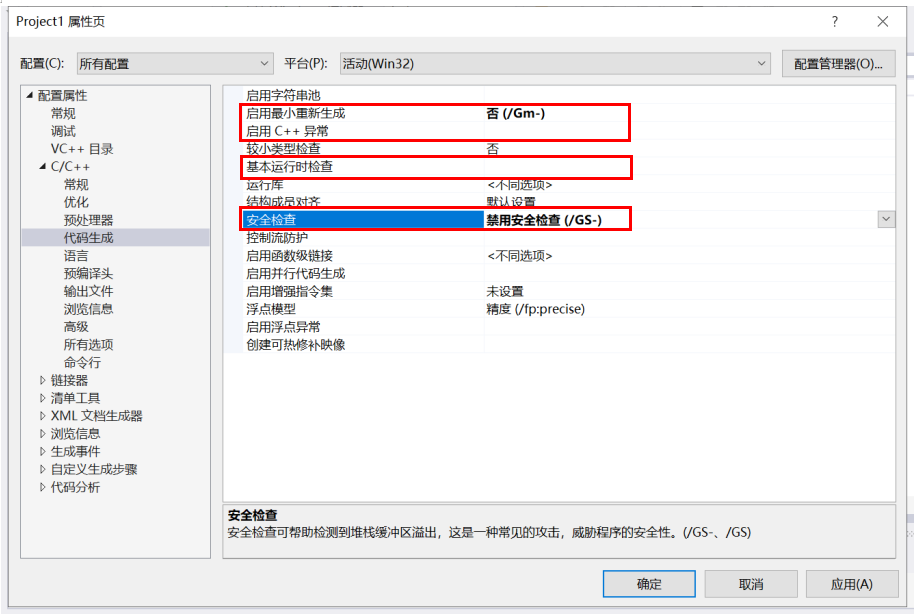
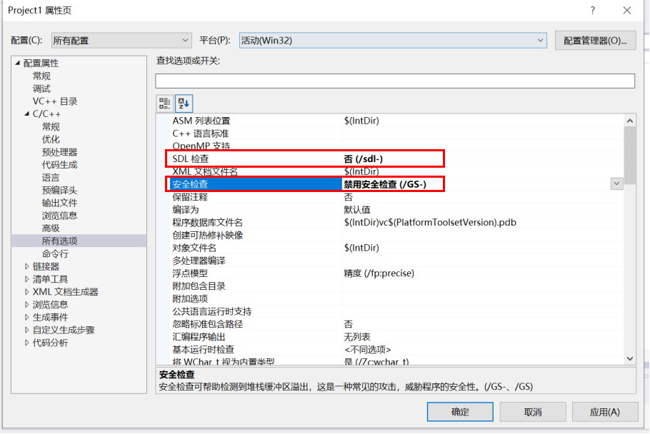
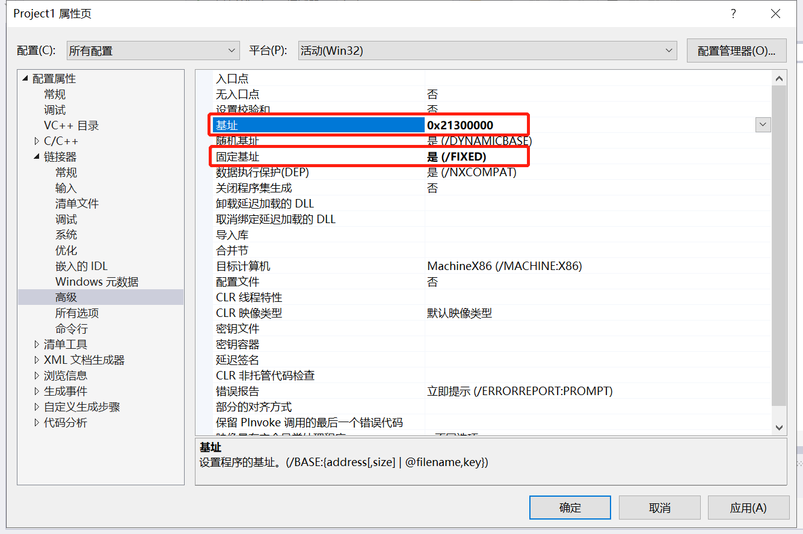
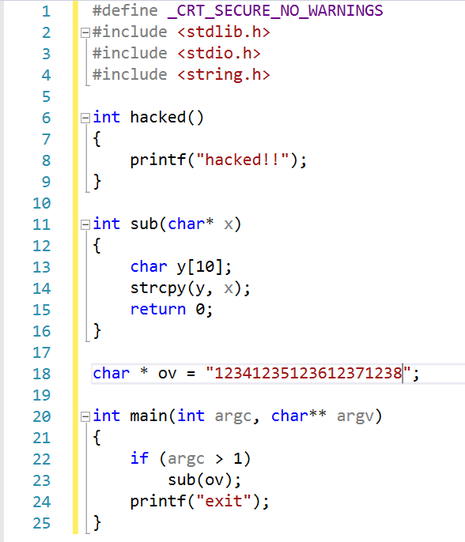
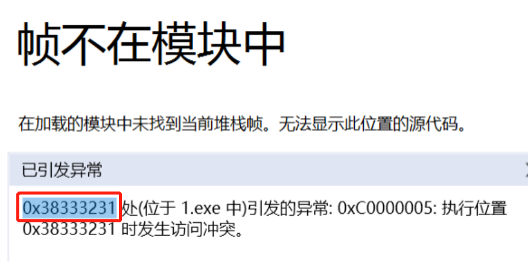
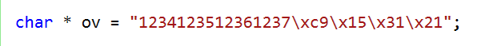
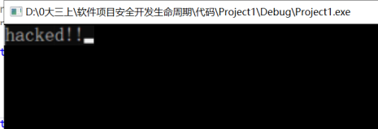

# 实验三 利用缓冲区溢出进行hacked函数攻击

## **一、实验目的**
* 编写程序实现在不调用hacked()函数的基础上，进入hacked()函数，并输出“hacked！”字符串。

## **二、基础知识**
* 程序执行过程中，线程使用栈形式的数据结构来保存和函数调用相关的数据，如函数调用的返回地址、主调函数的栈基址、局部变量和参数等。每次函数调用时，都会把以上数据按照一定的顺序入栈，函数返回时出栈，并且进行栈基址指针的改变。每次函数调用形成的新的栈的结构单元，称为栈帧，其实就是一个函数执行的环境：每个栈帧对应着一个未运行完的函数。栈帧中保存了该函数的返回地址和局部变量。

## **三、实验内容**
### （一）环境设置
* 在 属性—>C/C++—>代码生成 中设置对应值。

* 在 属性—>C/C++—>所有选项 中设置对应值。

* 在 属性—>链接器—>高级 中设置对应值。

### （二）编写代码
* 编写代码实现在不调用hacked()函数的基础上，进入hacked()函数，并输出“hacked！”字符串。（设置sub()的参数是"12341235123612371238"）

### （三）实验过程
* 直接运行代码，会出现以下报错
  
【这是由于在sub函数中，将长度很长的字符串x赋给了仅有10字节空间的y，导致溢出，覆盖了sub函数返回main函数的返回地址，此时返回地址变成了“0x38333231”】    
      
* 查阅AscII码表，发现0x38333231对应的十进制是“1238”  
  * 由此可知，源代码中ov字符串的“1238”位置是返回地址对应的位置
  * 那么只要将目标hacked()函数的地址填写在“1238”对应的位置，那么sub函数运行完就会跳转进入hacked()函数     

* 为了防止每次hacked()函数的地址都不同，所以在最初准备工作中设置了基址，确保每次函数地址不变
* 此时更改源代码的ov字符串，用0x213115c9代替1238的位置
  
* 再次运行，发现成功跳入了hacked()函数，输出了“hacked！”字符串
  
* 利用溢出的攻击实验成功