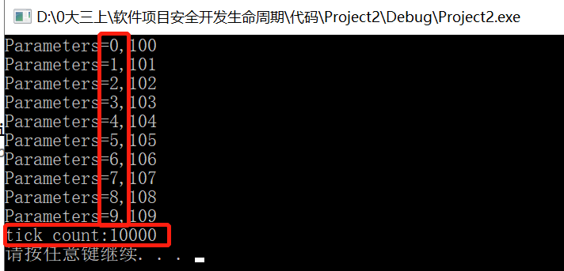

# 实验四 单线程&多线程

## **一、实验目的**
* Windows下使用CreateThread创建线程  
* 观察实现结果，学习线程的并发执行原理 

## **二、基础知识**
* 单线程
  * 每个正在运行的程序（即进程），至少包括一个线程，这个线程叫主线程
  * 主线程在程序启动时被创建，用于执行main函数
  * 只有一个主线程的程序，称作单线程程序
  * 主线程负责执行程序的所有代码。这些代码只能顺序执行，无法并发执行
* 多线程
  * 拥有多个线程的程序，称作多线程程序。
  * 相对于主线程来讲，其他线程，称为子线程
  * 子线程和主线程都是独立的运行单元，各自的执行互不影响，因此能够并发执行
* 单线程、多线程的区别
  * 单线程程序：只有一个线程，代码顺序执行，容易出现代码阻塞
  * 多线程程序：有多个线程，线程间独立运行，能有效地避免代码阻塞，并且提高程序的运行性能，但要占据更多的空间

## **三、实验内容**

### （一）编写代码
* 复制[示例代码](https://docs.microsoft.com/zh-cn/windows/win32/procthread/creating-threads)，调试执行程序。

### （二）实验过程
1. 单线程
* 调试程序，多次执行结果如下：
   * 可以观察到10个线程按顺序创建，并按顺序调度，所需总时间均超过或等于1000*10

2. 多线程
* 调试程序，多次执行结果如下：
   * 可以观察到10个线程按顺序创建，但随机调度，且每次结果不同，所需总时间均超过或等于1000

