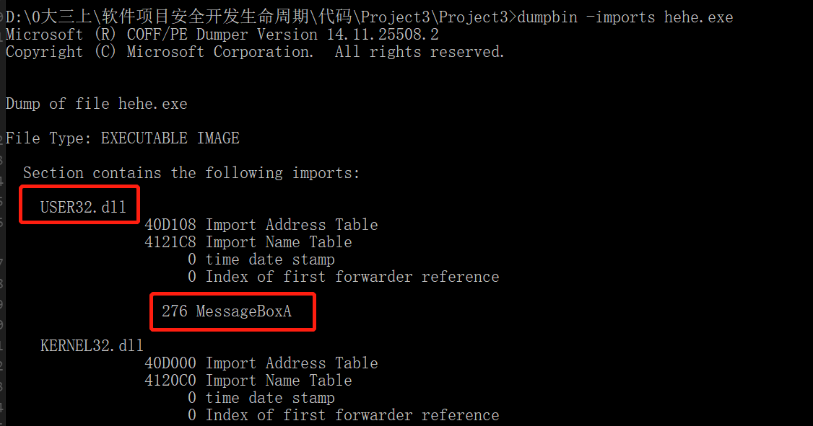

# 实验五 编写DLL&动态链接实验

## 手动编译链接基础实验：
* 在VS中新建一个项目，添加两个.c文件，a.c和b.c，内容如下    
  
  
* 手动编译链接文件
  * 编译用```cl.exe /c xxx.c```指令【其中/c代表只编译不链接】
  * 可以发现编译成功，生成了a.obj和b.obj两个文件
   
  * 将两个obj文件进行链接，用```link a.obj b.obj /out:haha.exe```指令，将链接得到的exe文件输出为haha.exe。
  * 观察到成功链接，生成了可执行文件。    
      
  * 执行起来没有报错，手动编译链接成功。 

  * 现在更改b.c的内容，调用一个MessageBox系统函数    
     
  * 重新编译b.c生成新的b.obj文件（覆盖了之前的文件）     
       
  * 将a.obj和新的b.obj进行链接，设置生成的exe文件名为hehe.exe     
    发现此时链接会报错，显示有一个无法解析的外部命令，即我们调用的MessageBox函数.去查找[MessageBox function的官方函数文献](https://docs.microsoft.com/zh-cn/windows/win32/api/winuser/nf-winuser-messagebox)，发现要想调用这个函数需要User32模块    
  * 所以在链接的时候要手动添加User32.lib文件    
         
  * 观察到这次链接成功了，没有报错，且运行hehe.exe也成功了。   
  * 对之前haha.exe和hehe.exe用dumpbin进行导入表的比较   
    发现hehe.exe确实多导入了User32.dll模块，其中有我们调用的MessageBox函数相关信息   
         
    

## 进阶实验

## **一、实验要求**
1. 会编写dll。把.c文件编译为obj文件，把obj文件和lib文件链接为新的dll和lib文件。注意使用def文件定义导出函数。
2. 编写一个exe，调用第一步生成的dll文件中的导出函数。方法是：
  * link时，将第一步生成的lib文件作为输入文件。
  * 保证dll文件和exe文件在同一个目录，或者dll文件在系统目录。

## **二、实验过程**
### 1. 编写DLL文件
* 在VS中新建一个项目base，添加两个文件，base.c和exp.def，内容如下
    
  
* 把base.c文件编译为base.obj文件
   
* 使用def文件定义导出函数，把base.obj文件和User32.lib文件链接为新的baselib.dll和base.lib文件  
     
    
* 以上是手动生成的方式

* 若用VS生成dll文件和lib文件，则需要进行以下设置 
  * 在工程属性—>配置属性—>常规中更改配置类型为动态库文件 
    
  * 在工程属性—>配置属性—>链接器—>输入中更改设置 
   
* 设置完成后重新生成项目，则可把obj文件和lib文件链接为新的dll和lib文件。 
* 用vs这样生成有一点小问题，就是生成的dll文件名没有生成baselib.dll，而是按照项目名称自动生成的base.dll，但并无大碍。
    

### 2. 编写一个exe，调用第一步生成的dll文件中的导出函数。 
* 在VS中新建一个项目app，添加app.c文件，内容如下图    
  app.c中调用了第一步生成的baselib.dll文件中的导出函数lib_function  
     
* 手动操作：
  * 先将第一布生成的baselib.dll文件拷贝到当前目录
  * 然后将app.c进行编译，得到app.obj文件，再通过```link app.obj ..\base\base.lib /out:app.exe```指令，将第一部生成的base.lib文件作为输入文件，链接生成app.exe文件，发现可以成功运行。   
    
  * 此时用dumpbin查看app.exe的导入表  
    可以发现导入了baselib.dll模块，其中包含我们的函数lib_function 
     
* 在VS中实现：
  * 首先应在base项目中添加头文件，并在app.c中include该头文件    
    
    
  * 在工程属性—>配置属性—>链接器—>输入中附加依赖项添加上base.lib文件 
       
  * 且将base.lib文件拷贝到app项目目录中   
    
  * 成功运行    
  