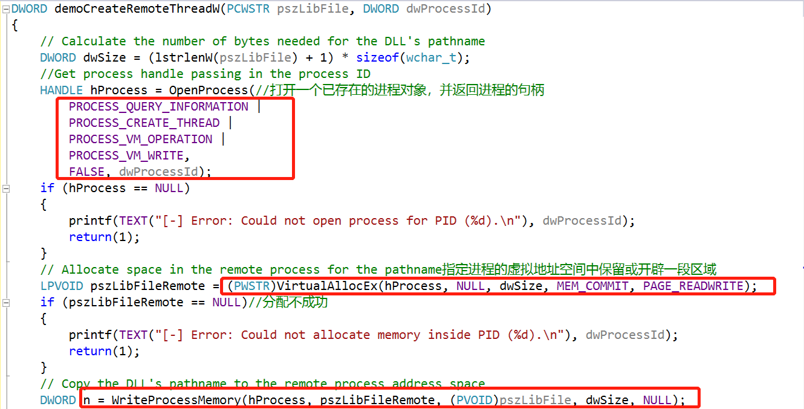
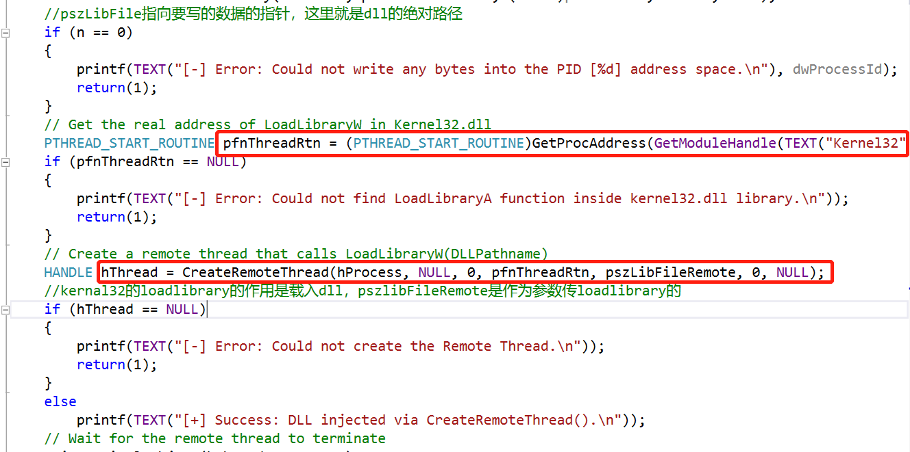
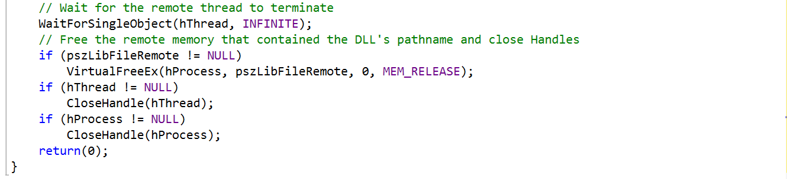
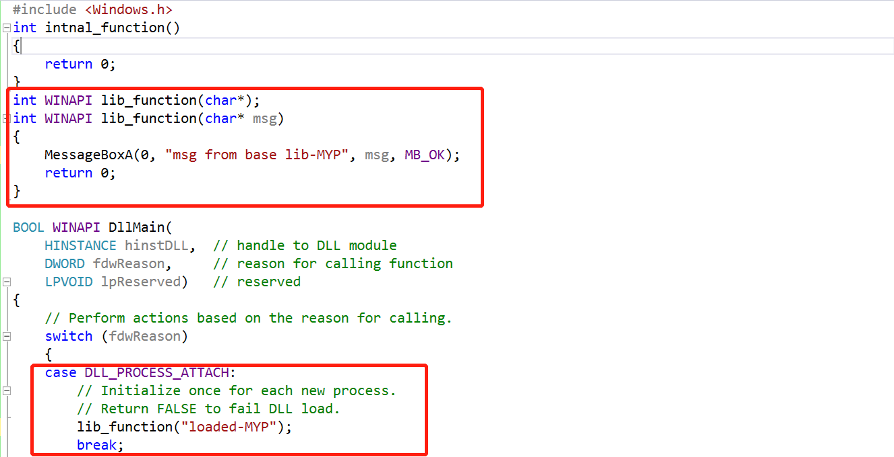
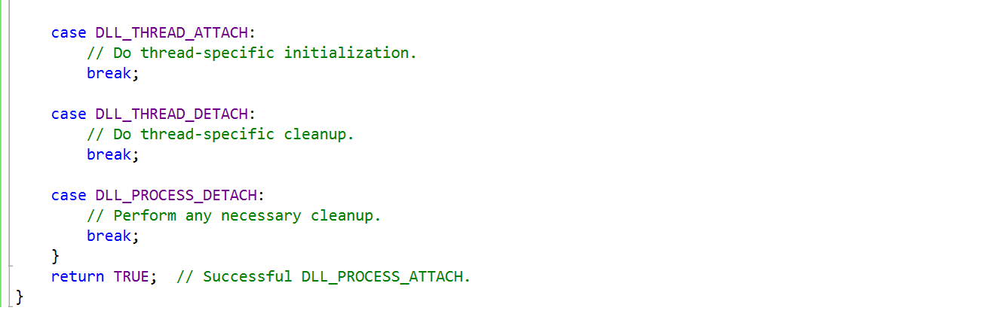
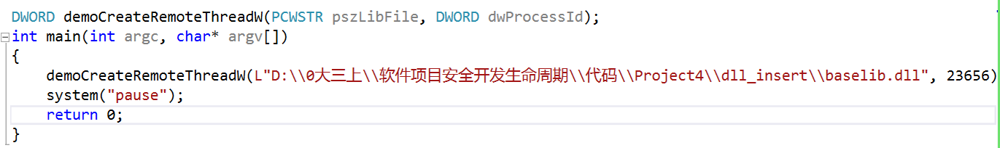
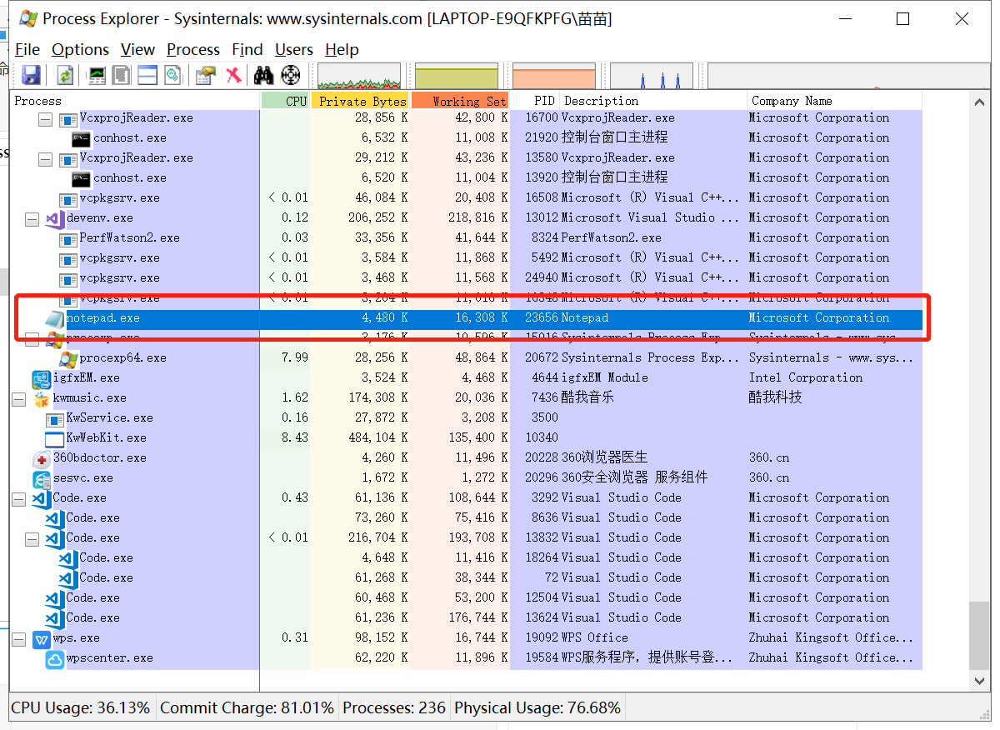
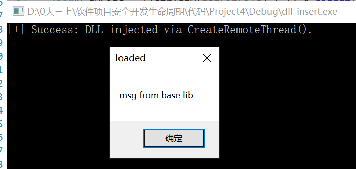
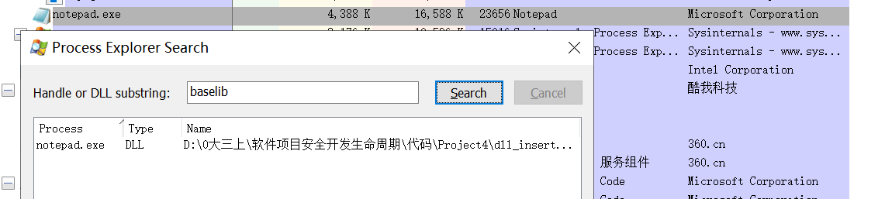

# 实验六 DLL注入实验

## **一、实验要求**
* 查文档，研究远程线程方式注入dll的实例代码的实现原理。   
* 运行实例代码，向一个目标程序（比如notepad.exe)注入一个我们自行编写的dll，加载运行。    
* 整合进程遍历的程序，使得攻击程序可以自己遍历进程得到目标程序的pid。   

## **二、实验过程**
1. 查文档，研究远程线程方式注入dll的实例代码的实现原理     
  * DLL注入步骤       
     
     
           
  * 准备即将注入的baselib.dll  
    * 加载了准备好的DLL     
  
  
* 运行示例代码，向一个目标程序（比如notepad.exe)注入一个编写好的dll文件，加载运行     
  * 主函数      
    【其中传入demoCreateRemoteThreadW函数的参数，第一个参数为baselib.dll的绝对地址；第二个参数为目标的将要被注入的程序的pid（可从资源管理器中查找）】           
     
        
  * 运行结果     
    * 程序运行，弹出MessageBox，符合baselib.dll中函数的应有结果  
    
    * 在Process Explorer工具中可以查找到此时baselib.dll确实已经注入到notepad.exe中了      
    
* 注入成功！！！     

## **注意事项**
1. 要在C:\Windows\SysWOW64 路径下打开notepad.exe
2. 路径要使用绝对路径，不然notepad.exe找不到baselib.dll的位置
3. baselib.dll文件需要与.c文件放在同一目录下