# 大作业 API hook & DLL注入相结合

## **一、实验目的**
1. 使用IAT hook技术将txt文件中的所有“呵呵”替换成“哈哈”   
2. 把IAT hook的代码包装成dll文件，并将该dll文件注入目标notepad.exe

## **二、基础知识**
* DLL 注入+ API hook技术实现对软件行为的篡改，是实现文件或者进程隐藏，外挂等的基础技术。
* IAT hook 是API hook的一种，API hook是通过修改函数的地址从而达到篡改程序行为的一种技术。

## **三、实验过程**
#### （一）用IAT hook技术替换WriteFile()函数
* 主函数wmain代码逻辑：

  (1) IATHook()函数 ：找到目标dll中的目标函数，用替换函数的地址进行替换，从而使程序调用目标函数时实际调用的是我们编写的替换函数。(可以通过反汇编观察地址变化，通过观察内存位置的变化确定IAK Hook成功。（这里忘记截图了）)
 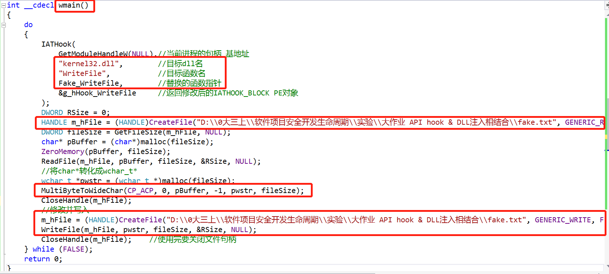
  (2) ReadFile函数 ： 读入fake.txt文件，将文件内容用MultiByteToWideChar转化成宽字节的Unicode编码格式，方便处理中文字符；
  
  (3) WriteFile函数（此时的WriteFile函数调用的是Fake_WriteFile函数） ：先获取原WriteFile函数的指针；将字符串中所有的“呵”字都替换成“哈”；将修改后的字符串用WideCharToMultiByte转化成ANSI或者UTF8编码格式（根据notepad的编码格式不同而不同）；最后调用原函数将修改后的字符串写入fake.txt文件中
   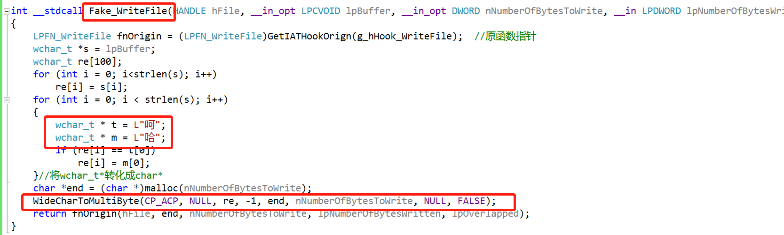
 
* 运行程序
  * 文件中原本的“大家一起呵呵呵呵呵呵呵呵呵！”变成了“大家一起哈哈哈哈哈哈哈哈哈！”   
  * 替换成功   
 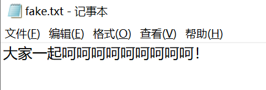 
 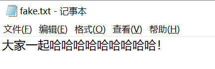     

#### （二）把IAT hook的代码包装成dll文件，并将该dll文件注入目标notepad.exe
1. 把IAT hook的代码包装成dll文件
* 在hook.c文件中添加DLLMain函数，在DLL_PROCESS_ATTACH情况下调用以上的wmain函数       
  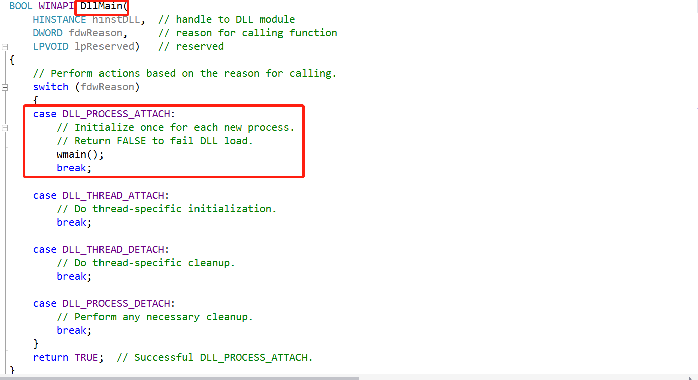    
* 添加exp.def文件，添加要导出的函数wmain      
  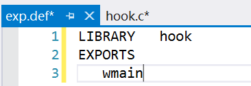     
* 在工程属性—>配置属性—>常规中更改配置类型为动态库文件 
    
* 在工程属性—>配置属性—>链接器—>输入中更改设置 
           
* 生成hook.dll文件  
  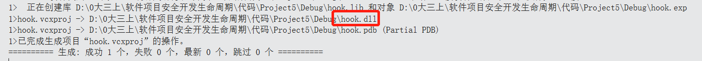      

2. 将该dll文件注入目标notepad.exe  
* 注入过程与第六次实验DLL注入一致，详情参考第六次实验报告。
* 整合进程遍历的程序，使得攻击程序可以自己遍历进程得到目标程序的pid ，进行我们编写的hook.dll的注入   
  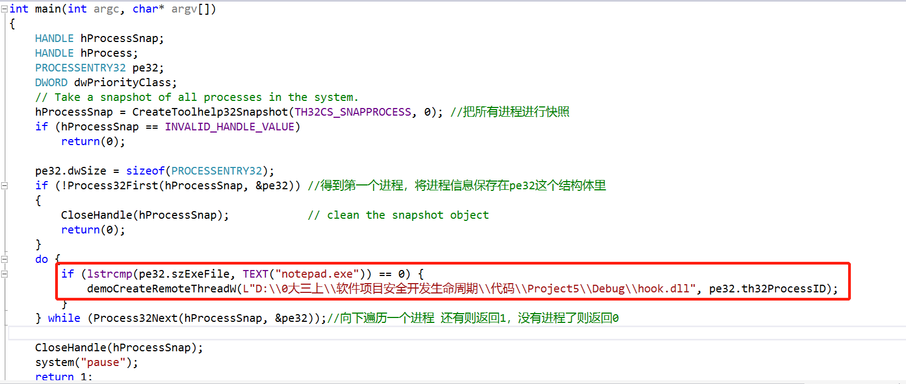 
* 打开32位的notepad.exe，向其中写入“一起呵呵呵呵呵呵呵呵呵！” 并保存为fake.txt文件  
    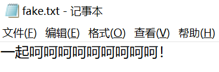
* 不要关闭这个fake.txt文件，直接运行dll注入程序，显示注入成功。    
    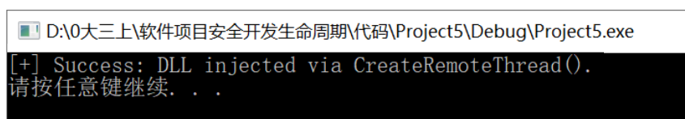   
* 关闭 fake.txt 文件，重新打开该文件就会观察到已经替换成功，变为“一起哈哈哈哈哈哈哈哈哈”    
    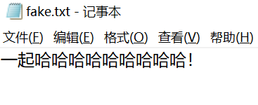
* 实验成功！！！！
